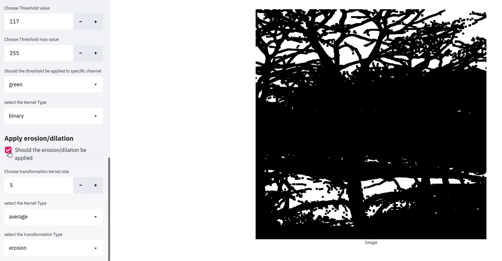

# image-transformations-app
A streamlit app to visualize images/video and apply basic image transformations to get some insights.
The app is built on streamlit and on the backend, opencv functions are called to be applied on the image. 


## Usage
A video could be analysed with the following command
```
streamlit run app.py --data path_to_video_file
```
or a folder of images could also be viewed
```
streamlit run app.py --data path_to_folder_containing_images
```

## Requirements
There are a few requirements before we can fully start using the list
```
opencv
streamlit
numpy 
glob
matplotlib
argparse
```

## Features
The repo has the following features to play with
### Basic Functions
This functions include some of the commonly used ones  
1) Conversion to Grayscale
2) Conversion to HSV
3) Displaying Histogram
4) Histogram equalization
5) Rotation of the image  


 

### Thresholding functions
It also provides simple thresholding functions that are part of the opencv. These can be applied to a specific channel and this can be chosen by the options.  


### Applying various filters
There is a provision to apply some of the common filters like gaussian kernels or a median filter. Even kernel size could be adjusted.  


### Applying Color transformations
Some of the common color transformations like contrast and brightness could be tweaked in the app. 


### Applying Image transformations
Apart from basic thresholding, even some morphological transformations can also be visualized.  


